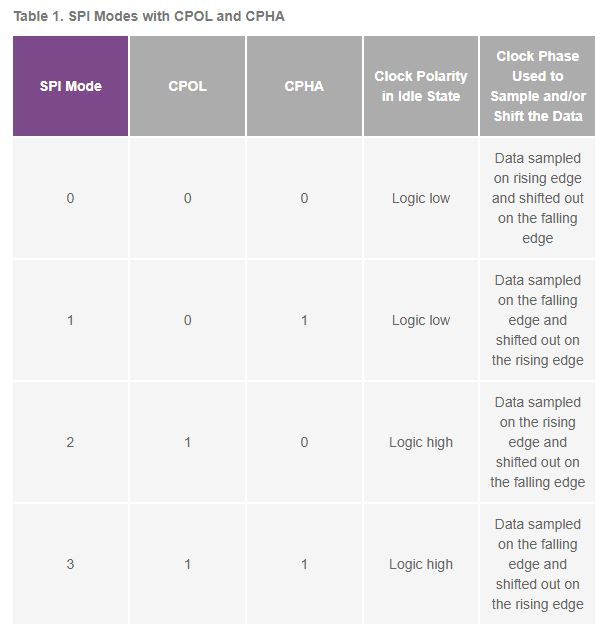

# Serial Peripheral Interface
### Gen Overview
- widely used interface between microcontroller and peripheral ICs such as sensors, ADCS, SRAM, etc
### Techn. Overview
- synchronous, full duplex main subnode based interface
- data from the main or the subnode is synchronized on the rising or falling clock edge
- both main and subnode can transmit data at the same time
- the master can talk to any slave but each slave can only talk to the master
- each slave must have its own unique slave select signal.
---
### Clock
- also known as SCLK or SPI CLK
- always generated from the controller or master
- clock must be lower than the maximum frequency for all devices involved.
- every time the clock is toggled, 1 bit is sent in each direction

### Chip Select
- also known as CS or SS (Slave Select)
- active low

---
### Clock Polarity
- CPOL bit sets the polarity of the clock signal during the idle state
- idle state is defined as the period when CS is high and transitioning to the low at the start of the transmission and when CS is low and transitioning to high at the end of the transmission
- essentially determining whether to have an active high or active low clock
### Clock Phase
- CPHA bit selects the clock phase
- depending on the CPHA bit, the rising or falling clock edge is used to sample and/or shift data
- essentially determining which edge oif the clock data is sampled
### SPI Modes with CPOL and CPHA

---
### example
- mode 0 -> CPOL = 0 (idle low) and CPHA = 0 (rising edge)
- master initiates transfer by pulling the CS signal low
- bits are then transferred on the rising edge of the clock in LSB

### properties of clock
- frequency determines the clock period, duty cycle, and phase
- frequency
    - how many cycles can be found in a certain period of time
- clock period
    - time taken to complete 1 cycle
- duty cycle
    - the amount of time the clock is high compared to its time period defines the duty cycle
- clock phase
    - if one cycle of a clock can be viewed as a complete circle (360deg) another clock can be relatively placed at a different place in the circle that occupies a different phase